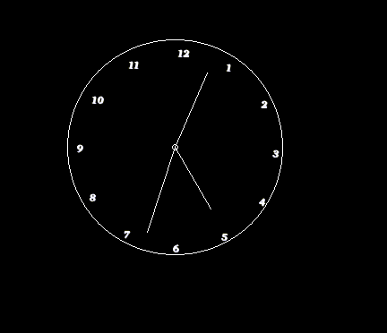

clockZ is a c/c++ graphical clock built using the graphics.h libroary

inorder to run it you'd have to install the graphics.h library

i have graphics.h in /usr/lib so 
i used

```
clang++ main.cpp -o main -lgraph -L/usr/lib
```
to compile clockZ

you should be able to run it with

```
./main
```



